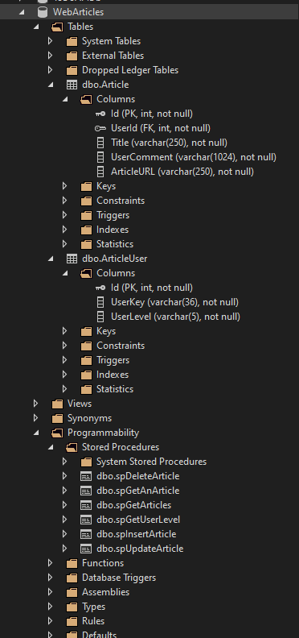

# Lab 4 - Web API

## Overview

For this lab you will create a complete API for a web application. You will start with the API provided. (https://github.com/blairDev/WebArticlesAPIStarter) `Test it completely, identify what needs to be completed, and go about getting it ready for production by finishing everything and testing all code.` The API will be used to create, read, update, and delete articles.  The articles will be stored in a database.  The API will be secured using a user key.  The user key will be used to determine if the user is an admin or a user.  The admin will be able to do anything a user can do, but a user will not be able to do everything an admin can do.

## Endpoints:

```
GET api/v1/article/all/userid
	Pass nothing in from body
	returns status code 401-unauthorized if user (admin OR user) not valid
	returns status code of 404-not-found id nothing is found
	returns status code of 500-internal-server-error if there is an error (exception)
	returns status code if 200-ok with list of all Articles

GET api/v1/article/5/userid
	Pass nothing in from body
	returns status code 401-unauthorized if user (admin OR user) not valid
	returns status code of 400-bad-request parameter is not valid (null) (ArgumentNullException)
	returns status code of 404-not-found id nothing is found
	returns status code of 500-internal-server-error if there is an error (exception)
	returns status code if 200-ok with the Article that was found

POST api/v1/article/userid
	Pass article in from body
	returns status code 401-unauthorized if user (admin OR user) not valid
	returns status code of 400-bad-request Article-URL not valid
	returns status code of 400-bad-request parameter is not valid (null) (ArgumentNullException)
	returns status code of 404-not-found id nothing is found
	returns status code of 500-internal-server-error if there is an error (exception)
	returns status code if 200-ok with the Article that was created

PUT api/v1/article/5/userid
	Pass article in from body (ArticleDTO)
	returns status code of 400-bad-request parameter is not valid (null) (ArgumentNullException)
	returns status code 401-unauthorized if user (admin only) not valid
	returns status code of 404-not-found if article id is not found
	returns status code of 500-internal-server-error if there is an error (exception)
	returns status code if 200-ok with the ArticleDTO that was updated

DELETE api/v1/article/5/userid
	Pass nothing in from body
	returns status code 401-unauthorized if user (admin only) not valid
	returns status code of 404-not-found if article id is not found
	returns status code if 200-ok with a string: $"Article {Id} deleted successfully"
```

Dotnet Status Codes Reference:
(https://learn.microsoft.com/en-us/dotnet/api/microsoft.aspnetcore.http.statuscodes?view=aspnetcore-7.0)

## Entities:

`ArticleUser`
```
Id int PK,
UserKey varchar(36),
UserLevel varchar(5)
```
`Article`
```
Id int PK,
UserId int FK,
Title varchar(250),
UserComment varchar(1024),
ArticleURL varchar(250)
```
`Entity Details:`
- Each table has a primary key of Id
- The Article table has a foreign key that points to the User table's Id
- The User Key is a GUID
- The Level field in User table should be either 'admin' or 'user'
	- user and view all articles, view an article by Id, and post an article
	- only an admin can update and delete articles
	- and admin can do anything a user level can do
- The Title must be 250 characters or less
- The Comment can not be more than 1024 characters
- The url can not be more than 250 characters

## Database DDL:
```sql	
Schemes (DDL):
CREATE TABLE [dbo].[ArticleUser] (
    [Id] INT IDENTITY (1, 1) NOT NULL,
    [UserKey] VARCHAR(36)    NOT NULL,
    [UserLevel] VARCHAR (5) NOT NULL,
    PRIMARY KEY CLUSTERED ([Id] ASC),
);

CREATE TABLE [dbo].[Article] (
    [Id] INT IDENTITY (1, 1) NOT NULL,
    [UserId] INT NOT NULL,
    [Title] VARCHAR (250) NOT NULL,
    [UserComment] VARCHAR (1024) NOT NULL,
	[ArticleURL] VARCHAR (250) NOT NULL,
    PRIMARY KEY CLUSTERED ([Id] ASC),
    CONSTRAINT [FKey_Article_User] FOREIGN KEY ([UserId]) REFERENCES [dbo].[ArticleUser] ([Id]) ON DELETE CASCADE ON UPDATE CASCADE
);

INSERT INTO dbo.ArticleUser (UserKey, UserLevel)
	VALUES ('74D16904-90FB-4BDF-9723-6A91A7EF7E70', 'admin');

INSERT INTO dbo.ArticleUser (UserKey, UserLevel)
	VALUES ('F81D647B-340D-4191-B4C6-6CB05B6C0ADD', 'user');

INSERT INTO dbo.Article (UserId, Title, UserComment, ArticleURL) 
	VALUES (1, 'Machine learning innovation reduces computer power usage', 'Their vision – getting server-scale performance from handheld devices', 'https://news.wsu.edu/news/2023/09/14/machine-learning-innovation-reduces-computer-power-usage/');

INSERT INTO dbo.Article (UserId, Title, UserComment, ArticleURL) 
	VALUES (1, 'Computational model helps with diabetes drug design', 'Researchers can use the model to predict how engineered forms of insulin would perform in human patients, making it easier to bring these drugs to clinical trials.', 'https://news.mit.edu/2023/computational-model-helps-diabetes-drug-design-0920');

INSERT INTO dbo.Article (UserId, Title, UserComment, ArticleURL)
	VALUES (2, 'Google DeepMind AI tool assesses DNA mutations for harm potential', 'AlphaMissense’s predictions could help speed up research and diagnosis of rare disorders', 'https://www.theguardian.com/science/2023/sep/19/google-deepmind-ai-tool-assesses-dna-mutations-for-harm-potential');

INSERT INTO dbo.Article (UserId, Title, UserComment, ArticleURL)
	VALUES (2, 'Smart Utility Meter Security Takes a Quantum Leap', 'Honeywell will secure its meters with cryptographic keys from Quantinuum', 'https://spectrum.ieee.org/smart-meter-security');
	
CREATE PROCEDURE [dbo].[spGetArticles]
	
AS
	SELECT * FROM dbo.Article;
GO 


CREATE PROCEDURE [dbo].[spGetAnArticle]
	@Id INT
AS
	SELECT * FROM dbo.Article WHERE Id = @Id;
GO


CREATE PROCEDURE [dbo].[spUpdateArticle]
	@Id int,
	@Title varchar(250),
	@UserComment varchar(1024),
	@ArticleURL varchar(250)
AS
	UPDATE dbo.Article SET Title = @Title, UserComment = @UserComment, ArticleURL = @ArticleURL
	WHERE Id = @Id
GO


CREATE PROCEDURE [dbo].[spInsertArticle]
	@Id int OUTPUT,
	@UserId int,
	@Title varchar(250),
	@UserComment varchar(1024),
	@ArticleURL varchar(250)
AS
	INSERT INTO dbo.Article (UserId, Title, UserComment, ArticleURL)
		VALUES (@UserId, @Title, @UserComment, @ArticleURL)
SELECT @Id = SCOPE_IDENTITY()


CREATE PROCEDURE [dbo].[spDeleteArticle]
	@Id INT
AS
	DELETE FROM [dbo].[Article]
		WHERE Id = @Id
GO


CREATE PROCEDURE [dbo].[spGetUserLevel]
	@UserKey VARCHAR(36)
AS
	SELECT UserLevel, Id FROM ArticleUser WHERE UserKey = @UserKey
GO
```

## Database Connection String:
Example but yours will be slightly different:

```C#
connectionString = @"Data Source=(localdb)\ProjectModels;Initial Catalog=WebArticles;Integrated Security=True;Connect Timeout=30";
```

## Visual Studio - SQL Server Object Explorer

Your Visual Studio SQL Server Object Explorer should look like this:

